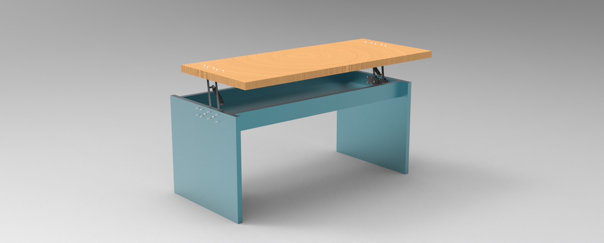
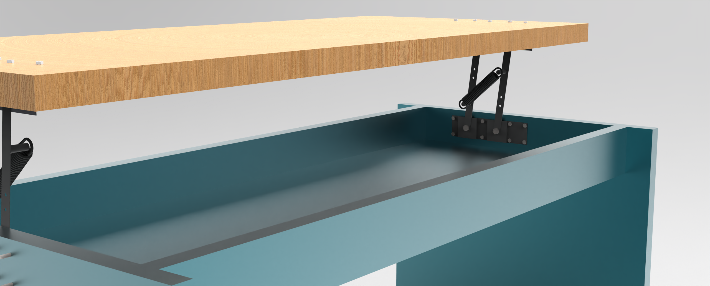
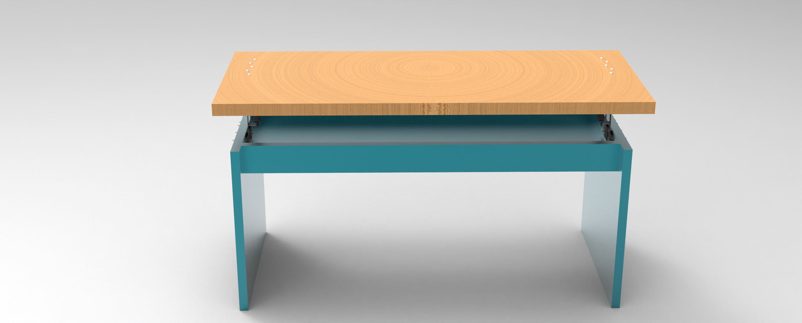
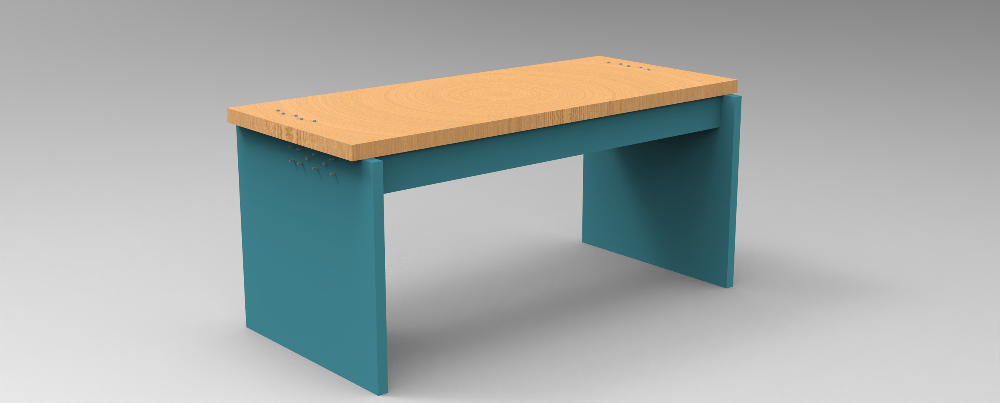

# Industrial Lift Table Design Project  

## 📌 Project Overview  
This project focuses on the design and analysis of an adjustable-height industrial lift table.  
The system includes a shaft, a wooden table plank, and a spring mechanism, designed and analyzed using MATLAB, SolidWorks, and ADAMS.  

The report covers:  
1. Shaft design and fatigue analysis using Goodman criteria.  
2. Table plank design and stress analysis under variable machine loads.  
3. Spring design to support oscillating forces within specified limits.  
4. Numerical optimization using MATLAB.  
5. Multibody simulation and validation in ADAMS.  

---

## 🎯 Objectives  
- Design a safe and cost-efficient shaft under combined bending and torsional stresses.  
- Optimize the table plank design to withstand variable machine loads.  
- Design a spring capable of handling specified force fluctuations.  
- Perform numerical optimization using MATLAB for shaft and plank sizing.  
- Validate spring deformation and mechanism behavior using ADAMS.  

---

## 🛠 Tools & Software  
- MATLAB – Numerical calculations, fatigue analysis, optimization.  
- SolidWorks – CAD modeling of shaft, table plank, and spring.  
- ADAMS – Multibody simulation of the lift mechanism.  
- Analytical Methods – Classical fatigue and stress analysis (Goodman, Shigley).  

---

## 📐 Methodology  

### 1. Shaft Design  
- Calculated forces and torques in XY and XZ planes.  
- Determined critical section with maximum bending and torsional stress.  
- Applied Goodman fatigue criterion with safety factor n = 3.  
- Selected optimal diameter and material (AISI steels, HR/CD).  

### 2. MATLAB Optimization (Shaft)  
- Automated shaft sizing for both hot-rolled (HR) and cold-drawn (CD) steels.  
- Compared material costs and selected the most economical option.  

### 3. Table Plank Design  
- Considered machine loads (min = 300 N, max = 450 N).  
- Analyzed bending stresses and fatigue safety factor.  
- Optimized plank thickness using MATLAB.  

### 4. Spring Design  
- Designed extension spring under oscillating load (1200–2400 N).  
- Calculated wire diameter, mean coil diameter, spring constant, and number of active coils.  
- Verified stress using Wahl correction factor.  
- Validated with MATLAB optimization and SolidWorks model.  

### 5. ADAMS Simulation  
- Modeled the lift table mechanism in ADAMS.  
- Simulated spring deflection and plank displacement in X and Y directions.  
- Verified system performance under applied load.  

---

## 📊 Results  
- Shaft design: Optimal diameters were found for both HR and CD steels (≈ 28.7 mm for CD, ≈ 33 mm for HR).  
- Cost analysis: CD steel (AISI 1030) was more economical than HR steel (AISI 1015).  
- Plank design: Optimized thickness achieved with oak wood, final cost ≈ 10,000,000 Toman for full table.  
- Spring design: Best design selected using Music Wire A228, meeting required force and deflection limits.  
- ADAMS validation: Simulations confirmed expected spring deflection and plank displacement.  

### Simulation Outputs  
-   
-   
-   
-   

---

## 📂 Repository Structure

├── matlab_code/ # MATLAB scripts for shaft, plank, and spring design

├── solidworks_model/ # CAD models of shaft, table plank, and spring

├── adams_model/ # ADAMS simulation files

├── images/ # Simulation plots (shaft, plank, spring, ADAMS)

└── README.md # This file

---

## 🔬 Applications  
- Industrial lift tables for machining and workshop environments.  
- Educational use in machine design and fatigue analysis.  
- Demonstrating integration of CAD, MATLAB optimization, and ADAMS simulation.  

---

## 👨‍🎓 Authors   
- Mohammad Mahdi Khademi
- Negar Naghavian

Supervised by: Dr. Seyed Hassan Zabihifar  
 
Course: Machine Component Design 

---

## 📖 References  
- Shigley’s Mechanical Engineering Design.  
- MATLAB documentation.  
- SolidWorks and ADAMS manuals.  
- Course lecture notes.
